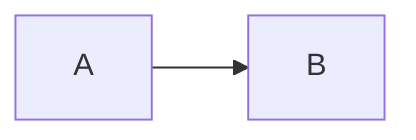
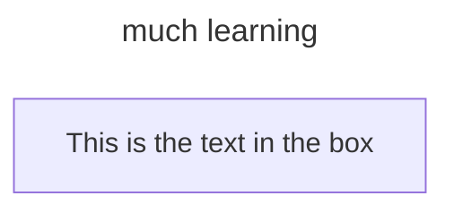

# Bluesky 
Bluesky[b] is a microblogging social media service. Similar to Twitter, users can share short text messages, images, and videos in short posts colloquially known as "skeets". It is owned by Bluesky Social PBC, a benefit corporation based in the United States.

## AT Protocol
The AT Protocol (Authenticated Transfer Protocol, pronounced "at-protocol" and commonly shortened to ATProto)[1][2] is a protocol and open standard for decentralized social networking services.[3] It is under development by Bluesky Social PBC, a public benefit corporation originally created as an independent research group within Twitter to investigate the possibility of decentralizing the service.[4]

# Personal Data Servers (PDS) #
Personal Data Servers (PDSes) host user repositories and their associated media. They also serve as the network access point for users, facilitating repository updates, backups, data queries, and user requests.[5]
Platform clients access the protocol on the user's behalf by querying their PDS, which, in turn, fetches the requested data from other services within the network. This design differs from ActivityPub, where protocol interactions and services are handled by monolithic host servers. Since network events are resolved through the protocol's network-wide indexing infrastructure, the availability of any single PDS is, by design, potentially inconsequential to the user experience.[23]
The AT Protocol prioritizes data portability, enabling users to back up and migrate repositories and associated media without data loss, even in the event of an adversarial PDS.[24] The design of PDSes within the protocol results in low computational requirements for operation, allowing individuals or groups to run their own PDSes without the need for significant computational resources.[3]

## Setting up a PDS ##
CURRENTLY it’s easiest to set up your own PDS via DigitalOcean 
Launch a server on any cloud provider, Digital Ocean and Vultr are two popular choices.
You can REALLY set up your own PDS with your own server - the server of choice appears to be Raspberry PI 
https://en.wikipedia.org/wiki/Raspberry_Pi

## Markdown and Mermaid
Markdown requires an extension for some applications but it is already enabled in others.
<a href="https://www.markdownguide.org">Markdown Guide</a>
### Mermaid ###
<a href="https://github.com/mermaid-js/mermaid?tab=readme-ov-file">Mermaid on Github</a>
Mermaid is enabled for Markdown (I think) but must always include 
-->```mermaid

At the start of a Mermaid diagram. The Mermaid diagram must also specify which type of diagram to be displayed.

For example --> flowchart


### Much learning ###
You can put a title in under the diagram type.

-->"C4Context"

-->"title Much Learning"


